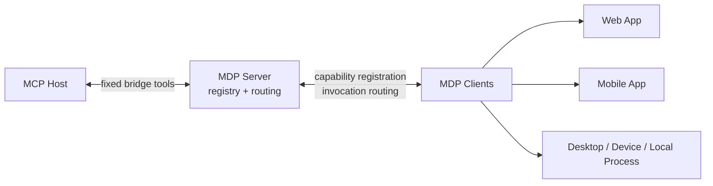

# Model Drive Protocol

| en-US | [zh-Hans](./README.zh-Hans.md) |
| --- | --- |

MDP turns runtime-local capabilities into MCP-reachable capabilities.

If your useful logic lives inside a browser tab, mobile app, desktop process, embedded runtime, or local agent, MDP gives it one bridge server to register with and one stable way for AI hosts to call it.

Instead of standing up a separate MCP server for every runtime, MDP keeps responsibilities clean:

- clients own capabilities
- the MDP server owns registration and routing
- MCP hosts talk to one fixed bridge surface

## Why MDP Exists

MCP is a strong host-side protocol, but many real capabilities live somewhere else: inside apps, devices, browser sessions, and local processes.

MDP is the layer between those runtimes and MCP. It lets arbitrary runtimes register capabilities and route invocations through one server without generating a brand-new MCP tool surface for every connected client.

A typical setup looks like this:

- a web app exposes user-context tools
- a mobile app exposes device-local actions
- a local process exposes operational procedures
- one MDP server presents all of them to MCP hosts through fixed bridge tools

That runtime can be:

- Web
- Android
- iOS
- Qt / C++
- Node.js
- Python / Go / Rust / Java
- native device or local agent processes

The core model is:

- clients provide capabilities
- the MDP server maintains registration and routing
- the MDP server exposes bridge tools to MCP hosts

Capabilities can be exposed as `tools`, `prompts`, `skills`, and `resources`.

Current transport support includes:

- `ws` / `wss` for bidirectional socket sessions
- `http` / `https` loop mode for long-polling runtimes
- auth envelopes on client registration and routed invocation messages

## Architecture

At a high level, MDP sits between MCP hosts and runtime-local capabilities:

## Documentation

Use the docs for getting started and protocol details:

- [Introduction](./docs/guide/introduction.md)
- [Quick Start](./docs/guide/quick-start.md)
- [Architecture](./docs/guide/architecture.md)
- [Protocol Overview](./docs/protocol/overview.md)
- [MCP Bridge](./docs/protocol/mcp-bridge.md)
- [Embedding Other Runtimes](./docs/client/embedding.md)
