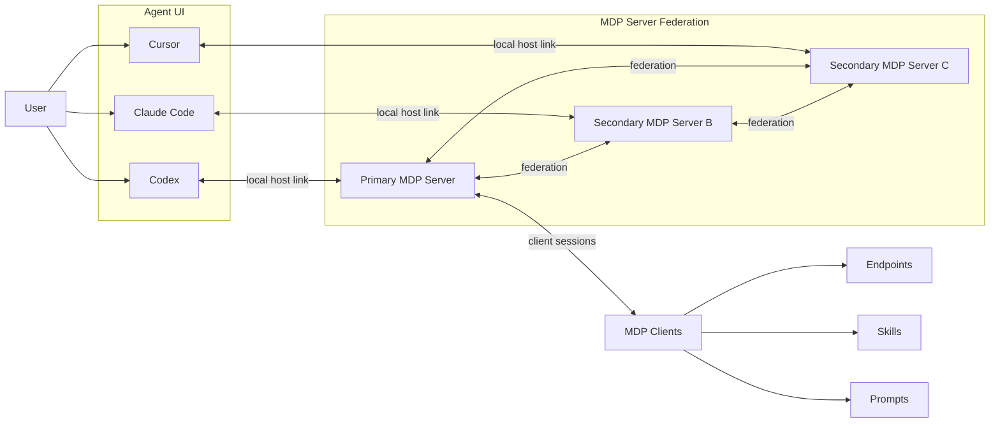
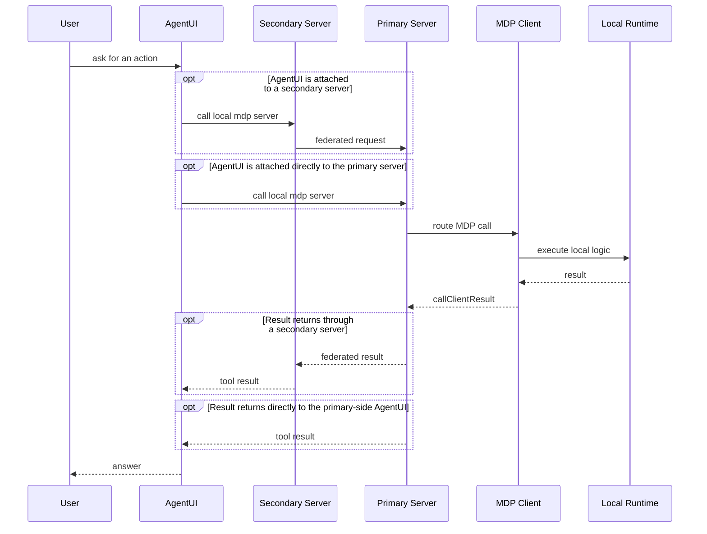

<p align="center">
  
</p>

# Model Drive Protocol

| en-US | [zh-Hans](./README.zh-Hans.md) |
| ----- | ------------------------------ |

> Expose runtime-local capabilities to AI agents - not just servers.

MDP is a bridge for capabilities that live inside active runtimes. Browsers, apps, local processes, IDE extensions, devices, and embedded runtimes can register structured paths with one MDP server, and MCP-compatible hosts can discover and invoke them through a stable bridge surface.

## The Problem

Most agent integrations assume useful capabilities live in MCP servers.

In practice, the best context often lives somewhere else:

- browser tabs with user session, DOM, page state, and extensions
- IDEs with workspace files, editor selection, diagnostics, and commands
- local processes with CLI tools, background services, and private state
- mobile apps and device runtimes with sensors, permissions, and user context

These runtimes are not naturally MCP servers.

Without MDP, teams usually end up:

- rewriting runtime logic into standalone servers
- building one-off bridges for each host/runtime pair
- losing the live context that made the capability valuable

## The Idea

MDP makes runtime capabilities discoverable as a path catalog.

```text
/browser
  /tabs
    /active
      /dom
      /selection
      /actions/click
```

That runtime can be:

- Web
- Android
- iOS
- Qt / C++
- Node.js
- Python / Go / Rust / Java / Kotlin / C#
- native device or local agent processes

Each path can be discovered and invoked. The runtime keeps ownership of the actual capability, while the MDP server owns registration, routing, and MCP exposure.

The path model is the API. Clients register descriptors with `expose()`, and hosts discover or invoke them through `listClients`, `listPaths`, `callPath`, and `callPaths`.

## Path-First, Skill-Aware

MDP does not flatten everything into a giant tool list. It supports endpoint paths, prompt paths, and skill paths:

- endpoint paths such as `GET /search`
- prompt paths that end with `/prompt.md`
- skill paths that end with `/skill.md`

Skills work well for progressive disclosure:

```text
/workspace/review/skill.md
/workspace/review/files/skill.md
/workspace/review/files/diff
```

An agent can start at a high-level skill, then read deeper paths only when it needs more context.

## Runtime -> MDP -> MCP

```text
Browser / App / Device / Local Process
              |
              v
          MDP Client
              |
              v
          MDP Server
              |
              v
          MCP Host
```

Agents do not need to know where a capability lives. A browser tab, VSCode extension, local process, or device runtime can all appear through one unified bridge surface.

The core responsibilities stay separate:

- clients own capabilities
- the MDP server owns registration and routing
- MCP hosts talk to one fixed bridge surface

## Why Not Just an MCP Server?

Because not every useful runtime should become a server.

| Scenario | Plain MCP server | MDP |
| -------- | ---------------- | --- |
| Browser tab state | Hard to expose without custom glue | Native runtime client |
| Mobile or device APIs | Often unrealistic as a server | Expose in place |
| Local app runtime | Heavyweight for simple local context | Direct runtime bridge |
| Multi-agent shared context | Fragmented across hosts | One shared registry surface |

## Quick Example

Expose a browser selection path from a runtime client:

```ts
client.expose({
  path: '/browser/selection',
  description: 'Read the current browser selection.',
  handler: async () => ({ text: window.getSelection()?.toString() ?? '' })
})
```

The MCP host sees `/browser/selection` through the MDP bridge. The call still executes inside the live browser runtime.

## What You Can Build

- AI coding agents with real IDE context
- browser-native agents without scraping workarounds
- mobile-aware and device-aware assistants
- local automation that keeps private runtime state local
- multi-agent systems sharing one runtime capability registry
- cross-device capability federation

## Current Status

- protocol models for path descriptors, messages, errors, and guards
- TypeScript MDP server with MCP bridge tools
- JavaScript client SDK with browser bundle output
- `ws` / `wss` and `http` / `https` loop transports
- auth envelopes and transport-carried auth support
- `GET /mdp/meta` probing and optional upstream discovery
- optional node-local filesystem state snapshots under `./.mdp/store` when enabled
- Chrome extension, VSCode extension, and browser simple client integrations
- primary-secondary server topology for layered local deployments

MDP is language-agnostic, but this repository currently ships the TypeScript/JavaScript reference implementation.

## One Sentence

MDP is the missing layer between runtime-local capabilities and AI agents.

## Architecture

At a high level, one user can work through different agent UIs such as Claude Code, Codex, or Cursor. Each UI talks to its own `mdp server`, those servers form a primary-secondary triangle, and all `mdp clients` connect only to the primary:



One invocation can go directly to the primary server, or pass through a secondary server when one is present:



Connection setup follows the same structure:

- each user connects to one AgentUI
- each AgentUI connects to its own colocated MDP server
- one MDP server becomes or is configured as the primary
- all runtime-local MDP clients open transports only to that primary server
- the primary forwards registry updates and routed messages to connected secondary servers
- if the primary server becomes unavailable, one secondary server should promote itself to the new primary and take over client-facing routing

## Pick A Path

- Use [Quick Start](./docs/guide/quick-start.md) if you want the shortest path from zero to a working client plus MCP bridge.
- Use [Server Tools](./docs/server/tools/index.md) and [Server APIs](./docs/server/api/index.md) if you already understand the model and need exact data formats.
- Use [JavaScript SDK Quick Start](./docs/sdk/javascript/quick-start.md) if you want to embed MDP into a browser page, local process, or custom runtime.
- Use [Go SDK](./sdks/go/README.md), [Python SDK](./sdks/python/README.md), [Rust SDK](./sdks/rust/README.md), [JVM SDKs](./sdks/jvm/README.md), or [.NET SDK](./sdks/dotnet/README.md) if you want a first-party runtime client outside JavaScript.
- Use [Chrome Extension](./docs/apps/chrome-extension.md) or [VSCode Extension](./docs/apps/vscode-extension.md) if you want a packaged runtime integration instead of wiring the SDK yourself.

## What Is In This Repo

- `packages/protocol`: protocol models, message types, guards, and errors
- `packages/server`: MDP server runtime, transport server, and fixed MCP bridge
- `packages/client`: JavaScript client SDK and browser bundle
- `sdks/python`: Python client SDK
- `sdks/go`: Go client SDK
- `sdks/rust`: Rust client SDK
- `sdks/jvm`: Java and Kotlin client SDKs
- `sdks/dotnet`: C# client SDK
- `apps/chrome-extension`: packaged Chrome runtime integration
- `apps/vscode-extension`: packaged VSCode runtime integration
- `docs`: VitePress documentation site and Playground

## Documentation

Use the docs for getting started, exact tool and API formats, and packaged integration guidance:

- [Quick Start](./docs/guide/quick-start.md)
- [What Is MDP?](./docs/guide/introduction.md)
- [Architecture](./docs/guide/architecture.md)
- [Server Tools](./docs/server/tools/index.md)
- [Server APIs](./docs/server/api/index.md)
- [JavaScript SDK Quick Start](./docs/sdk/javascript/quick-start.md)
- [Go SDK Quick Start](./docs/sdk/go/quick-start.md)
- [C# SDK Quick Start](./docs/sdk/csharp/quick-start.md)
- [Chrome Extension](./docs/apps/chrome-extension.md)
- [VSCode Extension](./docs/apps/vscode-extension.md)
- [Playground](./docs/playground/index.md)

## Contributing

For contributor workflow, release automation, maintainer setup, and CI internals, see [CONTRIBUTING.md](./CONTRIBUTING.md) and [docs/contributing](./docs/contributing/index.md).
