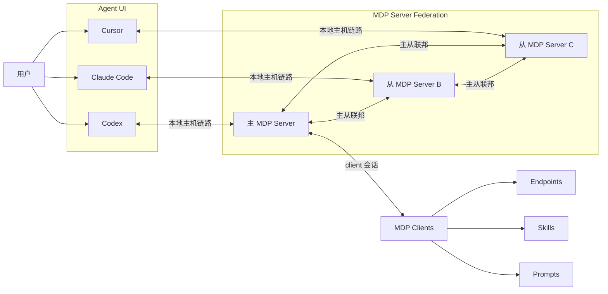
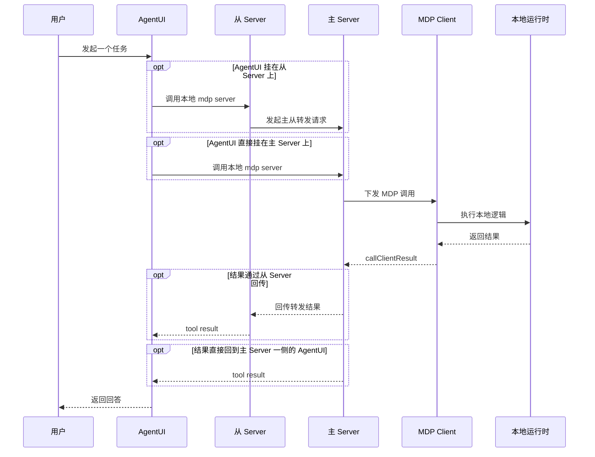

<p align="center">
  
</p>

# Model Drive Protocol（模型驱动协议）

| [en-US](./README.md) | zh-Hans |
| -------------------- | ------- |

> 把运行时本地能力暴露给 AI agent，而不是把每个运行时都改造成 server。

MDP 是连接活跃运行时能力的一层 bridge。浏览器、应用、本地进程、IDE 插件、设备和嵌入式运行时，都可以把结构化 path 注册到同一个 MDP server；兼容 MCP 的 host 再通过稳定 bridge surface 发现和调用它们。

## 问题

很多 agent 集成都默认：有用的能力应该存在于 MCP server 里。

但真实世界里，最有价值的上下文经常在别处：

- 浏览器标签页里的用户会话、DOM、页面状态和扩展能力
- IDE 里的工作区文件、编辑器选区、诊断和命令
- 本地进程里的 CLI 工具、后台服务和私有状态
- 移动应用和设备运行时里的传感器、权限和用户上下文

这些运行时天然不是 MCP server。

没有 MDP 时，团队通常只能：

- 把运行时逻辑重写成独立 server
- 为每一组 host/runtime 组合做一次性 bridge
- 丢掉真正有价值的实时上下文

## 核心想法

MDP 把运行时能力组织成可发现的 path catalog。

```text
/browser
  /tabs
    /active
      /dom
      /selection
      /actions/click
```

这些运行时可以是：

- Web
- Android
- iOS
- Qt / C++
- Node.js
- Python / Go / Rust / Java / Kotlin / C#
- 原生设备进程或本地 agent 进程

每个 path 都可以被发现和调用。运行时继续拥有真正的能力，MDP server 负责注册、路由和面向 MCP 的暴露。

path model 就是 API 本身。client 用 `expose()` 注册 descriptor，host 通过 `listClients`、`listPaths`、`callPath`、`callPaths` 完成发现和调用。

## Path-First，兼容 Skill

MDP 不会把一切都压平成巨大的 tool 列表。它支持 endpoint path、prompt path 和 skill path：

- 类似 `GET /search` 这样的 endpoint path
- 以 `/prompt.md` 结尾的 prompt path
- 以 `/skill.md` 结尾的 skill path

Skill 很适合渐进式披露：

```text
/workspace/review/skill.md
/workspace/review/files/skill.md
/workspace/review/files/diff
```

agent 可以先读取高层 skill，再在真正需要时继续读取更深的 path。

## Runtime -> MDP -> MCP

```text
Browser / App / Device / Local Process
              |
              v
          MDP Client
              |
              v
          MDP Server
              |
              v
          MCP Host
```

agent 不需要知道能力到底存在于哪里。浏览器标签页、VSCode 插件、本地进程或设备运行时，都可以通过同一个 bridge surface 呈现出来。

核心职责保持分离：

- client 拥有能力
- MDP server 负责注册与路由
- MCP host 面向固定的 bridge surface

## 为什么不直接做 MCP Server？

因为不是每个有用的运行时都应该变成 server。

| 场景 | 直接做 MCP server | MDP |
| ---- | ----------------- | --- |
| 浏览器标签页状态 | 需要大量自定义胶水代码 | 原生运行时 client |
| 移动端或设备 API | 通常不适合 server 化 | 原地暴露能力 |
| 本地应用运行时 | 为简单上下文引入过重 | 直接运行时桥接 |
| 多 agent 共享上下文 | 容易被不同 host 打散 | 一份共享 registry surface |

## 简短示例

从运行时 client 暴露一个浏览器选区 path：

```ts
client.expose({
  path: '/browser/selection',
  description: 'Read the current browser selection.',
  handler: async () => ({ text: window.getSelection()?.toString() ?? '' })
})
```

MCP host 会通过 MDP bridge 看到 `/browser/selection`。真正的调用仍然发生在当前浏览器运行时里。

## 可以构建什么

- 带真实 IDE 上下文的 AI coding agent
- 不依赖 scraping workaround 的浏览器原生 agent
- 理解移动端和设备状态的 assistant
- 保持私有运行时状态留在本地的自动化
- 多 agent 共享同一份运行时能力 registry
- 跨设备能力 federation

## 当前状态

- path descriptor、message、error、guard 的 protocol model
- 带 MCP bridge tools 的 TypeScript MDP server
- 带浏览器 bundle 输出的 JavaScript client SDK
- `ws` / `wss` 与 `http` / `https loop` transports
- auth envelope 和 transport-carried auth 支持
- `GET /mdp/meta` 探测与可选上游发现
- 启用后可在 `./.mdp/store` 下写入节点本地文件系统状态快照
- Chrome 插件、VSCode 插件和 browser simple client 集成
- 面向分层本地部署的主从 server topology

MDP 本身与语言无关，但这个仓库当前提供的是 TypeScript/JavaScript 参考实现。

## 一句话

MDP 是连接运行时本地能力与 AI agent 的缺失层。

## 架构图

高层上，一个用户可以通过不同的 Agent UI 使用系统，例如 Claude Code、Codex、Cursor。每个 UI 都有一个自己的 `mdp server`；这些 server 呈现主从三角互联，而所有 `mdp client` 只连接主 server：



一次调用既可以直接进入主 server，也可以在存在从 server 时先经过从 server：



连接建立过程同样是分层的：

- 每个用户先连接一个 AgentUI
- 每个 AgentUI 再连接自己对应的本地 MDP server
- 其中一个 MDP server 被配置或选举为主 server
- 所有运行时本地 `mdp client` 只向这个主 server 建立 transport
- 主 server 再把 registry 更新和路由消息转发给各个从 server
- 如果主 server 不可用，则应由某个从 server 自动提升为新的主 server，并接管面向 client 的路由

## 先选一条入口

- 如果你想先用最短路径跑通链路，从 [快速开始](./docs/zh-Hans/guide/quick-start.md) 开始。
- 如果你已经理解模型，只想看精确的工具与接口数据格式，直接看 [工具集](./docs/zh-Hans/server/tools/index.md) 和 [对外接口](./docs/zh-Hans/server/api/index.md)。
- 如果你要把 MDP 接进浏览器页面、本地进程或自定义运行时，优先看 [JavaScript SDK / 简易上手](./docs/zh-Hans/sdk/javascript/quick-start.md)。
- 如果你需要 JavaScript 之外的官方运行时 client，直接看 [Go SDK](./sdks/go/README.md)、[Python SDK](./sdks/python/README.md)、[Rust SDK](./sdks/rust/README.md)、[JVM SDKs](./sdks/jvm/README.md) 和 [.NET SDK](./sdks/dotnet/README.md)。
- 如果你更想直接从现成集成开始，优先看 [Chrome 插件](./docs/zh-Hans/apps/chrome-extension.md) 和 [VSCode 插件](./docs/zh-Hans/apps/vscode-extension.md)。

## 仓库里有什么

- `packages/protocol`：协议模型、消息类型、guards 和错误模型
- `packages/server`：MDP server runtime、transport server 与固定 MCP bridge
- `packages/client`：JavaScript client SDK 和浏览器 bundle
- `sdks/python`：Python client SDK
- `sdks/go`：Go client SDK
- `sdks/rust`：Rust client SDK
- `sdks/jvm`：Java 与 Kotlin client SDK
- `sdks/dotnet`：C# client SDK
- `apps/chrome-extension`：打包好的 Chrome 运行时集成
- `apps/vscode-extension`：打包好的 VSCode 运行时集成
- `docs`：VitePress 文档站和 Playground

## 文档入口

开始使用、查看精确工具与接口格式，以及了解现成集成方式，请查看文档站：

- [快速开始](./docs/zh-Hans/guide/quick-start.md)
- [什么是 MDP？](./docs/zh-Hans/guide/introduction.md)
- [架构](./docs/zh-Hans/guide/architecture.md)
- [工具集](./docs/zh-Hans/server/tools/index.md)
- [对外接口](./docs/zh-Hans/server/api/index.md)
- [JavaScript SDK / 简易上手](./docs/zh-Hans/sdk/javascript/quick-start.md)
- [Go SDK / 简易上手](./docs/zh-Hans/sdk/go/quick-start.md)
- [C# SDK / 简易上手](./docs/zh-Hans/sdk/csharp/quick-start.md)
- [Chrome 插件](./docs/zh-Hans/apps/chrome-extension.md)
- [VSCode 插件](./docs/zh-Hans/apps/vscode-extension.md)
- [Playground](./docs/zh-Hans/playground/index.md)

## 共建说明

贡献流程、发布自动化、维护者配置和 CI 说明请查看 [CONTRIBUTING.md](./CONTRIBUTING.md) 和 [docs/zh-Hans/contributing](./docs/zh-Hans/contributing/index.md)。
