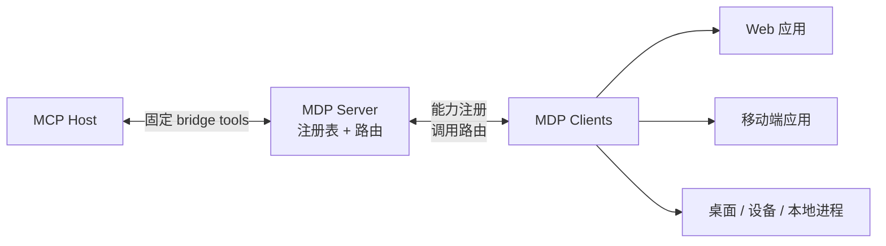

# Model Drive Protocol（模型驱动协议）

| [en-US](./README.md) | zh-Hans |
| --- | --- |

MDP 把原本困在各个运行时里的能力，变成 AI 可通过 MCP 调用的能力。

如果你的关键逻辑存在于浏览器标签页、移动端应用、桌面进程、嵌入式运行时，或者本地 agent 进程里，MDP 提供一个统一的 bridge server，让这些能力可以被注册，也让 AI host 能以稳定方式调用它们。

它不要求你为每一种运行时都单独实现一个 MCP server，而是把职责拆分清楚：

- client 拥有能力
- MDP server 负责注册与路由
- MCP host 面向固定的 bridge surface

## 为什么需要 MDP

MCP 很适合 host 侧接入，但真实世界里的能力往往不在 host 里，而是在应用、设备、浏览器会话和本地进程里。

MDP 就是连接这些运行时与 MCP 的那一层。它让任意运行时都能把能力注册到同一个 server 上，再通过统一桥接面向 MCP，而不是为每个已连接 client 动态生成一套新的 MCP tools。

一个典型场景是：

- Web 应用暴露带用户上下文的 tools
- 移动端应用暴露设备侧能力
- 本地进程暴露运维或自动化过程
- 一个 MDP server 用固定的 bridge tools 把这些能力统一提供给 MCP host

这个运行时可以是：

- Web
- Android
- iOS
- Qt / C++
- Node.js
- Python / Go / Rust / Java
- 原生设备进程或本地 agent 进程

核心模型是：

- client 提供能力
- MDP server 维护注册与路由
- MDP server 向 MCP host 暴露 bridge tools

能力可以以 `tools`、`prompts`、`skills`、`resources` 的形式暴露。

## 架构图

高层上，MDP 位于 MCP host 和运行时本地能力之间：

## 文档入口

开始使用和协议细节，请查看文档站：

- [介绍](./docs/zh-Hans/guide/introduction.md)
- [快速开始](./docs/zh-Hans/guide/quick-start.md)
- [架构](./docs/zh-Hans/guide/architecture.md)
- [协议概览](./docs/zh-Hans/protocol/overview.md)
- [MCP Bridge](./docs/zh-Hans/protocol/mcp-bridge.md)
- [嵌入其他运行时](./docs/zh-Hans/client/embedding.md)
