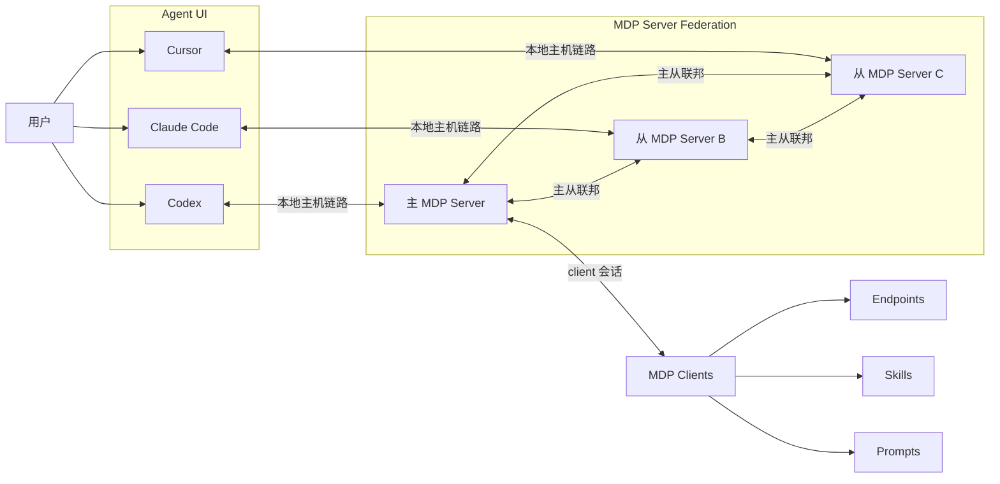
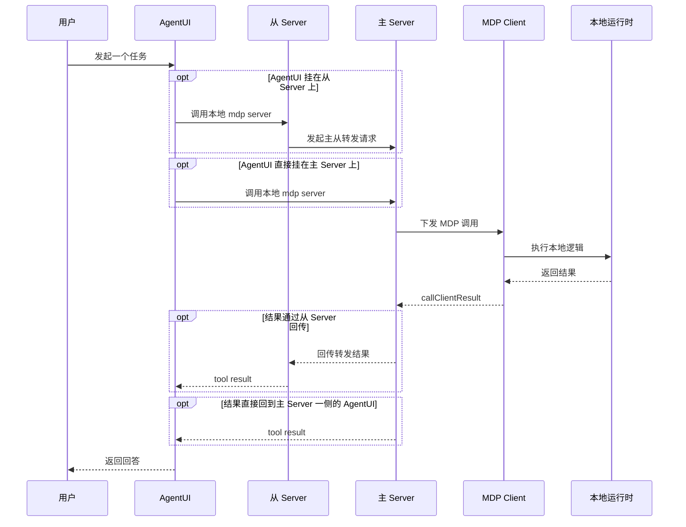

  

# Model Drive Protocol（模型驱动协议）

| [en-US](./README.md) | zh-Hans |
| -------------------- | ------- |

> 模型与万物建立连接的终极方案

MDP 把原本困在各个运行时里的本地路径目录，变成 AI 可通过 MCP 调用的能力。

如果你的关键逻辑存在于浏览器标签页、移动端应用、桌面进程、嵌入式运行时，或者本地 agent 进程里，MDP 提供一个统一的 bridge server，让这些能力可以被注册，也让 AI host 能以稳定方式调用它们。

它不要求你为每一种运行时都单独实现一个 MCP server，而是把职责拆分清楚：

- client 拥有能力
- MDP server 负责注册与路由
- MCP host 面向固定的 bridge surface

## 为什么需要 MDP

MCP 很适合 host 侧接入，但真实世界里的能力往往不在 host 里，而是在应用、设备、浏览器会话和本地进程里。

MDP 就是连接这些运行时与 MCP 的那一层。它让任意运行时都能把 path descriptor 注册到同一个 server 上，再通过统一桥接面向 MCP，而不是为每个已连接 client 动态生成一套新的 MCP tools。

一个典型场景是：

- Web 应用暴露带用户上下文的 tools
- 移动端应用暴露设备侧能力
- 本地进程暴露运维或自动化过程
- 一个 MDP server 用固定的 bridge tools 把这些能力统一提供给 MCP host

这个运行时可以是：

- Web
- Android
- iOS
- Qt / C++
- Node.js
- Python / Go / Rust / Java
- 原生设备进程或本地 agent 进程

核心模型是：

- client 提供路径目录
- MDP server 维护注册与路由
- MDP server 向 MCP host 暴露 bridge tools

当前 path model 支持：

- 类似 `GET /search` 这样的 endpoint path
- 以 `/prompt.md` 结尾的 prompt path
- 以 `/skill.md` 结尾的 skill path

其中 skill 特别适合做渐进式披露，例如 `/workspace/review/skill.md`、`/workspace/review/files/skill.md`。host 只在需要时继续读取更深路径。

path model 就是 API 本身。client 用 `expose()` 注册 descriptor，host 通过 `listClients`、`listPaths`、`callPath`、`callPaths` 完成发现和调用。

当前 transport 支持包括：

- 用于双向会话的 `ws` / `wss`
- 面向长轮询运行时的 `http` / `https loop`
- 在 client 注册和路由调用消息里携带 auth envelope
- 通过请求头或 `/mdp/auth` cookie bootstrap 传递 transport auth
- 通过 `GET /mdp/meta` 探测某个端口是否正在提供 MDP 服务，并支持可选的上游发现
- 启用后可在 `./.mdp/store` 下写入节点本地文件系统状态快照

MDP server 也可以运行在一个简单的分层拓扑里：

- `auto`（默认）：一个 server 成为运行时本地 clients 的主 registry，其他 server 作为从节点挂上去
- `standalone`：单个 server 独立持有本地 registry，不和其他 server 建链
- `proxy-required`：启动时必须找到上游主 MDP server，否则直接快速失败

从主从视角看，`mdp client` 只连接主 server；从 server 持续连到主 server，这样每个 AgentUI 都可以通过自己的本地 server 访问同一份 client registry。

## 架构图

高层上，一个用户可以通过不同的 Agent UI 使用系统，例如 Claude Code、Codex、Cursor。每个 UI 都有一个自己的 `mdp server`；这些 server 呈现主从三角互联，而所有 `mdp client` 只连接主 server：

一次调用既可以直接进入主 server，也可以在存在从 server 时先经过从 server：

连接建立过程同样是分层的：

- 每个用户先连接一个 AgentUI
- 每个 AgentUI 再连接自己对应的本地 MDP server
- 其中一个 MDP server 被配置或选举为主 server
- 所有运行时本地 `mdp client` 只向这个主 server 建立 transport
- 主 server 再把 registry 更新和路由消息转发给各个从 server
- 如果主 server 不可用，则应由某个从 server 自动提升为新的主 server，并接管面向 client 的路由

## 先选一条入口

- 如果你想先用最短路径跑通链路，从 [快速开始](./docs/zh-Hans/guide/quick-start.md) 开始。
- 如果你已经理解模型，只想看精确的工具与接口数据格式，直接看 [工具集](./docs/zh-Hans/server/tools/index.md) 和 [对外接口](./docs/zh-Hans/server/api/index.md)。
- 如果你要把 MDP 接进浏览器页面、本地进程或自定义运行时，优先看 [JavaScript SDK / 简易上手](./docs/zh-Hans/sdk/javascript/quick-start.md)。
- 如果你更想直接从现成集成开始，优先看 [Chrome 插件](./docs/zh-Hans/apps/chrome-extension.md) 和 [VSCode 插件](./docs/zh-Hans/apps/vscode-extension.md)。

## 仓库里有什么

- `packages/protocol`：协议模型、消息类型、guards 和错误模型
- `packages/server`：MDP server runtime、transport server 与固定 MCP bridge
- `packages/client`：JavaScript client SDK 和浏览器 bundle
- `apps/chrome-extension`：打包好的 Chrome 运行时集成
- `apps/vscode-extension`：打包好的 VSCode 运行时集成
- `docs`：VitePress 文档站和 Playground

## 文档入口

开始使用、查看精确工具与接口格式，以及了解现成集成方式，请查看文档站：

- [快速开始](./docs/zh-Hans/guide/quick-start.md)
- [什么是 MDP？](./docs/zh-Hans/guide/introduction.md)
- [架构](./docs/zh-Hans/guide/architecture.md)
- [工具集](./docs/zh-Hans/server/tools/index.md)
- [对外接口](./docs/zh-Hans/server/api/index.md)
- [JavaScript SDK / 简易上手](./docs/zh-Hans/sdk/javascript/quick-start.md)
- [Chrome 插件](./docs/zh-Hans/apps/chrome-extension.md)
- [VSCode 插件](./docs/zh-Hans/apps/vscode-extension.md)
- [Playground](./docs/zh-Hans/playground/index.md)

## 共建说明

贡献流程、发布自动化、维护者配置和 CI 说明请查看 [CONTRIBUTING.md](./CONTRIBUTING.md) 和 [docs/zh-Hans/contributing](./docs/zh-Hans/contributing/index.md)。
