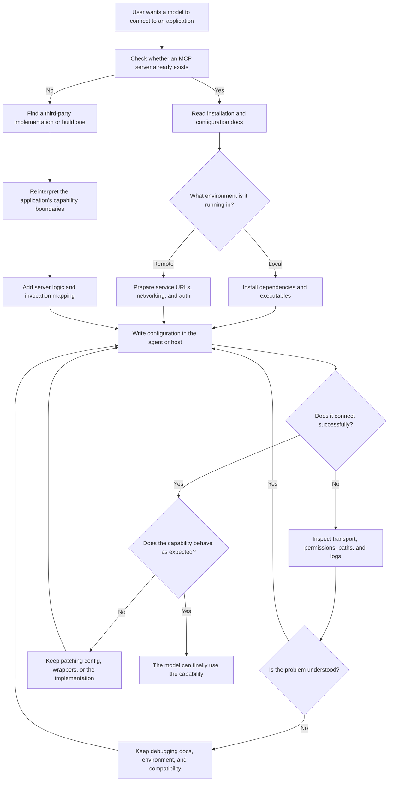
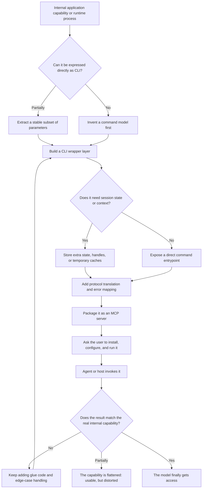
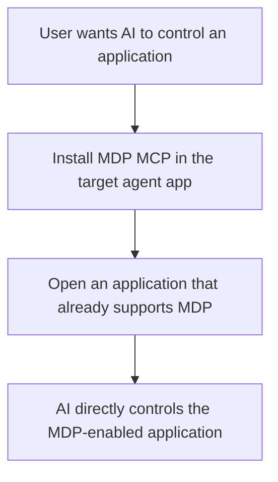

# Why I Created This Project

## The Problem

I created MDP because I believe today's MCP ecosystem, while useful in some cases, is still far from making it truly cheap and easy for large models to connect to the real world.

Many discussions focus on whether there is a tool protocol at all, or whether capabilities can technically be exposed to a model. But in practice, what determines whether an approach can scale is not whether it works in theory. It is whether it is light enough in engineering cost, product cost, and user experience.

If a system can only be used reliably by a small number of highly technical users, or if it only feels usable after a platform wraps it in a thick product layer, then it is still far from real adoption. That is the core reason I started MDP. The problem is not that we need a few more tools. The problem is that connecting models to everything is still too complex.

## User Cost

From a user perspective, MCP is still complex to configure and expensive to use. It often assumes that the user understands servers, configuration files, connection methods, permission boundaries, and similar concepts. If the user does not have that knowledge, they end up relying on an agent platform or product layer to hide the complexity for them. But once that wrapper is gone, or once the platform does not handle the integration for them, the user is back to doing the setup manually. The barrier has not actually disappeared.

An even more practical issue is that many applications still require the user to install an MCP server themselves. That means the responsibility for integrating capabilities gets pushed onto the end user. If someone wants a model to operate a tool, an application, or a local environment, they first have to figure out how to install it, configure it, run it, and maintain it. A small number of technical users may tolerate that. But if the goal is broader product adoption, that path is clearly too heavy.

### Integration Path

The problem with this path is not only that it has many steps. It is that every step requires the user to understand internal system structure. Installation, configuration, startup, and debugging should not be the user's main job, but in the current model they often become the prerequisite for use.

## Internal Processes

There is also a deeper problem that has not really been solved well. A large amount of application-internal or process-internal behavior cannot naturally be exposed through a unified, standard protocol. So in practice we keep writing CLIs, repackaging internal behavior into command-line interfaces, and then trying to make models call those commands. But that approach has obvious limits.

CLI is suitable for exposing some capabilities, but not all capabilities. Many processes are inherently runtime-bound, context-dependent, event-driven, or tied to GUI state, in-memory state, session lifecycle, or object references inside a host environment. Those things cannot always be expressed clearly as a single command with a few parameters. Some processes cannot realistically be exposed through CLI at all, and even when they can, the cost in maintenance, abstraction loss, and usability is often very high.

An editor selection state, the live semantic state of a browser page, an event stream in an extension host, or a session object inside a running application are not naturally shaped like "input parameters -> run command -> return result." Once you force them into a CLI model, you also take on the burden of projecting state, syncing lifecycle, preserving context, and dealing with interface degradation.

### Wrapping Path

The real issue in this path is not whether invocation is possible. It is whether the cost of making it invocable is justified. Many rich, evolving, context-dependent internal processes lose part of their meaning once they are flattened into CLI form. They may look integrated, but a lot of the real expressive power is gone.

## Complexity Shift

That is the trap I keep seeing. MCP tries to solve tool integration, but like many other tool systems, it still struggles to cover capabilities that live closer to the actual runtime state of applications. And once you try to bridge that gap, the cost rises quickly, and you end up back on the same road: one-off adaptation, one-off wrappers, and one-off bridges for each scenario.

The complexity does not disappear. It just moves around. Sometimes it lands on end users. Sometimes it lands on platforms. Sometimes it lands on application developers. But no matter where it lands, the work starts to look the same: extra glue code, extra compatibility logic, extra installation paths, extra state synchronization.

Once complexity can only be absorbed through local wrappers, the ecosystem keeps fragmenting. Every platform needs its own integration style. Every application needs its own bridge. Every host may need its own wiring rules. In the end, model-to-world connection looks unified from a distance, but underneath it is still a patchwork of fragmented solutions.

## Why MDP

I do not want to keep stacking more and more local patches on top of this. I want to define a layer that is actually better suited for large models to connect to everything, so that capability exposure, registration, discovery, invocation, and routing can all sit on a more natural standard, rather than forcing every problem into "install a server and expose a few CLIs."

That is why I designed MDP. Its goal is not to replace one specific tool. Its goal is to solve a more fundamental problem: how applications, processes, host environments, and the real capabilities inside them can be connected to large models through a unified, standard, and lightweight protocol.

I want capability providers to expose capabilities closer to their real runtime, instead of always having to detour through the command line. I also want hosts to integrate against a stable bridge surface instead of reinventing wiring every time they connect to a new system. Most importantly, I do not want end users carrying the engineering burden every time they want to connect one more capability.

### Simplified Path

The change is that users no longer need to research whether an application has its own server, how transport should be configured, where configuration files live, or how to manually walk through the whole wiring process. From the user's point of view, the path becomes a few direct actions: install MDP MCP in the agent app, open an application that supports MDP, and let AI control it.

## What Gets Simplified

With this model, capabilities do not need to be flattened into command lines first. They do not need to depend on users manually installing pieces for every application. They do not need a thick platform wrapper every time. And they do not require a new communication pattern for every host shape. Applications can become direct capability sources, the server can handle registration and routing, and the host can keep a stable bridge surface.

### Specific Costs

What gets reduced are several recurring categories of cost:

- the cost for users to learn installation, configuration, and debugging flows
- the cost for platforms to repeatedly build wrapper layers for different capability sources
- the cost of losing real capability expressiveness just to fit command-line abstractions
- the cost of every host and every application building its own bridge

## Final Goal

I do not believe any protocol solves everything in one move. But I do believe the direction has to be correct first. What MDP is trying to do is bring those hard-to-unify, expensive-to-integrate, difficult-to-productize problems back into a framework that can actually be standardized, engineered, and scaled.

That is why I created this project. Not to add one more concept, but to make it easier for large models to connect to everything, and to finally make that possible at a more reasonable cost.
