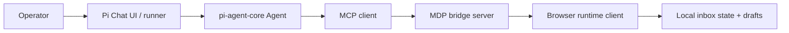

# Pi Agent Assistant

This example shows one concrete way to combine MDP with the Pi agent stack from [`pi-mono`](https://github.com/badlogic/pi-mono):

- [`pi-agent-core`](https://github.com/badlogic/pi-mono/tree/main/packages/agent) owns the agent loop, state, and tool execution
- [`pi-web-ui`](https://github.com/badlogic/pi-mono/tree/main/packages/web-ui) is the natural place to render the chat shell if you want a full app UI
- MDP owns capability registration and runtime routing, so the agent can reach browser-local tools through one fixed bridge

## What the example app does

The browser page keeps a small support inbox locally and exposes these capabilities through MDP:

- tools: `listTickets`, `getTicket`, `saveDraft`
- prompt: `replyTicket`
- skill: `support/reply-workflow`
- resources: `inbox://support/playbook`, `inbox://support/open-queue`

The Pi agent runner starts the local MDP server, waits for the browser runtime to register, then uses the MCP bridge tools to call those browser-owned capabilities.



## Files

- Live runtime page: [/examples/pi-agent-assistant/index.html](/examples/pi-agent-assistant/index.html)
- Browser runtime source: [/examples/pi-agent-assistant/index.html](/examples/pi-agent-assistant/index.html)
- Pi agent runner: [/examples/pi-agent-assistant/agent-runner.mjs](/examples/pi-agent-assistant/agent-runner.mjs)
- Example-local package manifest: [/examples/pi-agent-assistant/package.json](/examples/pi-agent-assistant/package.json)

## Why this split works

Pi already separates agent state and tool execution from UI rendering. That matches MDP well:

- Pi keeps the deliberation loop, streaming events, and tool orchestration
- MDP keeps runtime-local ownership, registration, and routing
- the browser runtime keeps the data that should not be copied into the host process unless requested

That means the agent can stay generic while the browser, IDE, or local app remains the capability owner.

## Run it

From the repo root:

```bash
pnpm build
```

Then in the example folder:

```bash
cd examples/pi-agent-assistant
npm install
npm run start:web
```

Open `http://127.0.0.1:4173`, keep the page open, then in a second shell:

```bash
export OPENAI_API_KEY=...
npm run start:agent -- "Review open tickets, read the playbook, and save a calm reply draft for the most urgent unresolved ticket."
```

The runner defaults to `openai/gpt-4o-mini`. Override with `PI_MODEL_PROVIDER` and `PI_MODEL_ID` if you want another Pi-supported model.
