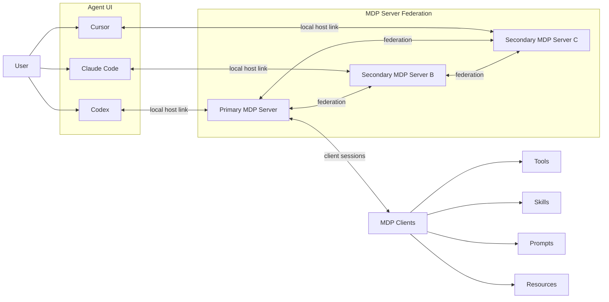
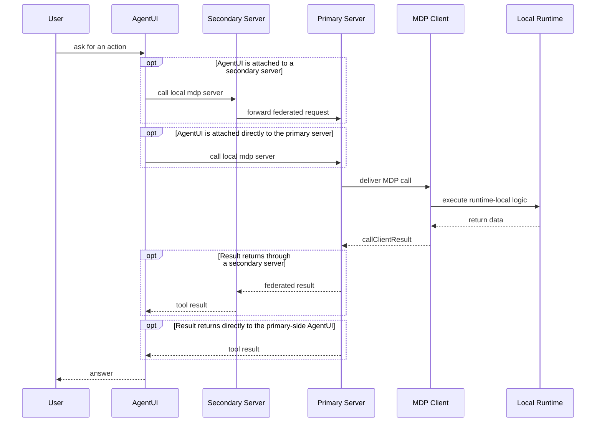
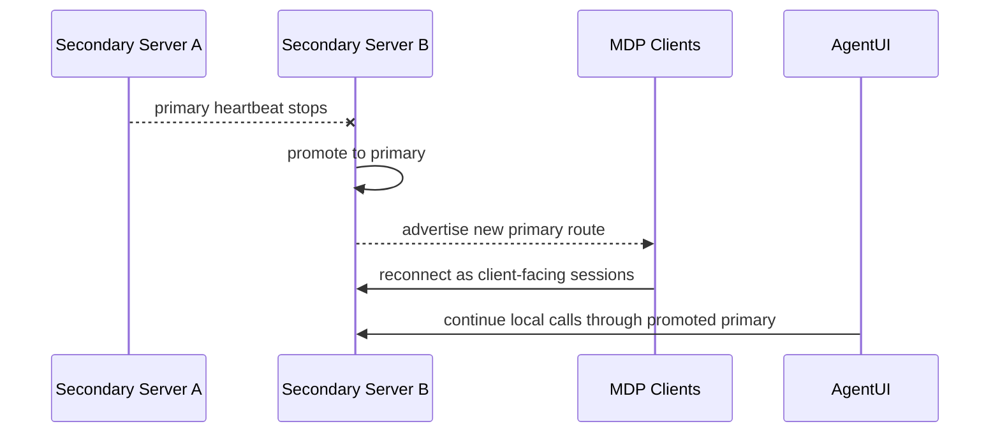

# Architecture

The end-to-end system has five roles:

1. The user starts using one agent tool by entering a prompt.
2. Each `AgentUI` talks to its own colocated `mdp server`.
3. One `primary mdp server` owns the runtime-local client registry.
4. One or more `secondary mdp servers` stay connected to that primary.
5. `MDP clients` expose concrete runtime-local capabilities and connect only to the primary.

## Invocation Path

One routed call across the full stack can go either through a secondary server or directly to the primary:

## Failover Path

If the current primary server becomes unavailable, one secondary server should promote itself to the new primary so the federation can keep routing client calls.

The architectural rule is simple:

- clients normally connect only to the current primary server
- secondaries monitor the primary server
- when the primary disappears, one secondary becomes the new primary
- clients and AgentUI-side traffic should converge on that promoted primary
- the federation should then reform around the new primary

For the concrete startup modes and examples, see [Deployment Modes](/server/deployment). For the server-side runtime model, see [Server Overview](/server/overview).
