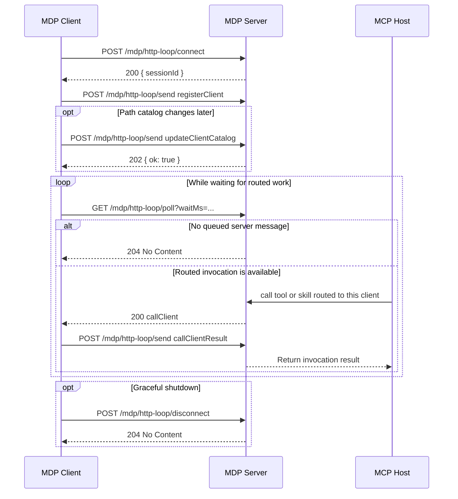

# HTTP Loop Connection

HTTP loop is the request-response transport alternative to websocket sessions.

## Endpoint summary

| Method | Path                                                            | Purpose                                  |
| ------ | --------------------------------------------------------------- | ---------------------------------------- |
| `POST` | [`/mdp/http-loop/connect`](/server/api/http-loop-connect)       | Create a loop session                    |
| `POST` | [`/mdp/http-loop/send`](/server/api/http-loop-send)             | Send one client-to-server MDP message    |
| `GET`  | [`/mdp/http-loop/poll`](/server/api/http-loop-poll)             | Receive one server-to-client MDP message |
| `POST` | [`/mdp/http-loop/disconnect`](/server/api/http-loop-disconnect) | Close the loop session                   |

## Session identification

After `connect`, later requests must include the session ID in either:

- the `x-mdp-session-id` header
- the `sessionId` query parameter

## Connect

Request:

```json
{}
```

Response:

```json
{
  "sessionId": "6c8a3b2b-7f2b-4be5-a2d8-1f0c8c4f8b54"
}
```

## Polling flow

1. `POST /connect`
2. send [registerClient](/server/api/register-client) through `/send`
3. optionally send [updateClientCatalog](/server/api/update-client-capabilities) through `/send` when the local path catalog changes
4. `GET /poll` until the server returns [callClient](/server/api/call-client) or `204`
5. send [callClientResult](/server/api/call-client-result) through `/send`
6. `POST /disconnect`

`waitMs` on `/poll` is clamped to `60000`.

## Sequence diagram



For request and response details per endpoint, continue with:

- [POST /mdp/http-loop/connect](/server/api/http-loop-connect)
- [POST /mdp/http-loop/send](/server/api/http-loop-send)
- [GET /mdp/http-loop/poll](/server/api/http-loop-poll)
- [POST /mdp/http-loop/disconnect](/server/api/http-loop-disconnect)

## Use it when

- the runtime cannot keep a websocket open
- the environment only supports plain HTTP request-response loops
