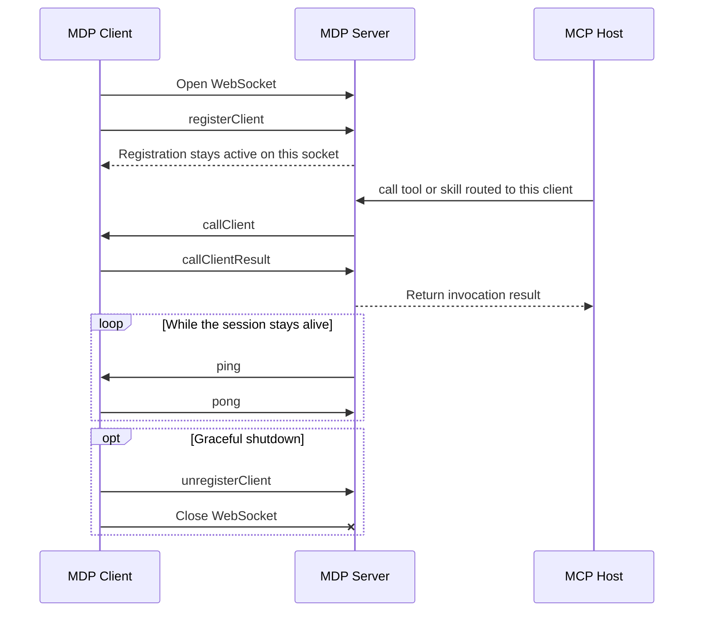

# WebSocket Connection

Use the websocket transport when the client can keep a long-lived bidirectional connection open.

## Endpoint

- `ws://127.0.0.1:7070`
- with TLS enabled: `wss://127.0.0.1:7070`

## Message model

The websocket endpoint accepts JSON-encoded MDP messages.

## Event types

The websocket transport uses the `type` field as the event discriminator.

| Event type         | Direction        | Category   | Purpose                                         |
| ------------------ | ---------------- | ---------- | ----------------------------------------------- |
| `registerClient`   | Client -> Server | Lifecycle  | Register one client and its capability metadata |
| `unregisterClient` | Client -> Server | Lifecycle  | Remove one registered client                    |
| `callClient`       | Server -> Client | Invocation | Deliver routed capability work to the client    |
| `callClientResult` | Client -> Server | Invocation | Return the result of a routed invocation        |
| `ping`             | Both directions  | Heartbeat  | Keep the session alive                          |
| `pong`             | Both directions  | Heartbeat  | Acknowledge a heartbeat                         |

## By direction

Client-to-server events:

- [registerClient](/server/api/register-client)
- [unregisterClient](/server/api/unregister-client)
- [callClientResult](/server/api/call-client-result)
- [ping](/server/api/ping)
- [pong](/server/api/pong)

Server-to-client events:

- [callClient](/server/api/call-client)
- [ping](/server/api/ping)
- [pong](/server/api/pong)

## Event flow

The normal websocket sequence is:

1. open the websocket
2. send `registerClient`
3. receive `callClient` when the server routes work
4. send `callClientResult`
5. exchange `ping` and `pong` while the session stays alive
6. optionally send `unregisterClient` before disconnecting

## Sequence diagram

## What each event is for

- `registerClient`: announces client identity and the current tool, prompt, skill, and resource catalog.
- `unregisterClient`: removes one logical client registration without requiring the whole transport to disappear first.
- `callClient`: carries one routed invocation with `requestId`, target client, capability kind, and invocation payload.
- `callClientResult`: closes the routed invocation by returning either `data` or `error`.
- `ping`: asks the other side to prove the connection is still alive.
- `pong`: confirms a received `ping`.

## Use it when

- the runtime can hold a stable socket
- you want lower-latency push in both directions
- you do not want to implement long-poll session management
