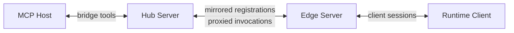

# Deployment Modes

The server can run either as one standalone registry or as one edge that mirrors local clients into an upstream hub.

The default CLI startup mode is `auto` on port `47372`.

The intended rule is simple:

- hosts talk to one hub-facing bridge surface
- runtime-local clients usually talk to the nearest edge
- the choice between hub and edge is deployment policy, not client guesswork

## Standalone

Use standalone mode when one server owns the local registry and bridge surface.

```bash
npx @modeldriveprotocol/server --port 47372 --server-id hub
```

Use this when:

- you only need one local MDP server
- clients can register directly with the bridge-facing server
- you want the simplest local setup

## Auto

Auto mode first probes for an upstream MDP hub. If it finds one, it mirrors local clients upward. If it does not, it keeps running as a standalone server.

```bash
npx @modeldriveprotocol/server --cluster-mode auto --server-id edge-01
```

By default the discovery process:

- probes `127.0.0.1`
- starts at port `47372`
- checks up to `100` consecutive ports
- uses `GET /mdp/meta` to decide whether a port is serving MDP
- verifies that the upstream metadata advertises a compatible protocol version before opening the proxy link

Tune discovery when needed:

```bash
npx @modeldriveprotocol/server \
  --cluster-mode auto \
  --discover-host 127.0.0.1 \
  --discover-start-port 47372 \
  --discover-attempts 100 \
  --server-id edge-01
```

## Proxy-Required

Proxy-required mode is the strict version of auto mode. The server must find an upstream hub or fail startup.

```bash
npx @modeldriveprotocol/server \
  --cluster-mode proxy-required \
  --discover-host 127.0.0.1 \
  --discover-start-port 47372 \
  --discover-attempts 100 \
  --server-id edge-02
```

Use this when:

- the server should never become the root bridge by accident
- your deployment expects one explicit hub
- startup should fail fast instead of silently changing topology

## Explicit Upstream

If you already know the hub URL, skip scanning and point the edge at it directly.

```bash
npx @modeldriveprotocol/server \
  --port 47170 \
  --cluster-mode proxy-required \
  --upstream-url ws://127.0.0.1:47372 \
  --server-id edge-01
```

This is the most predictable choice for scripts, tests, and fixed local development setups.

## Probe Endpoint

Discovery uses the metadata probe:

- `GET /mdp/meta`

Example response:

```json
{
  "protocol": "mdp",
  "protocolVersion": "0.1.0",
  "supportedProtocolRanges": ["^0.1.0"],
  "serverId": "127.0.0.1:47372",
  "endpoints": {
    "ws": "ws://127.0.0.1:47372",
    "httpLoop": "http://127.0.0.1:47372/mdp/http-loop",
    "auth": "http://127.0.0.1:47372/mdp/auth",
    "meta": "http://127.0.0.1:47372/mdp/meta"
  },
  "features": {
    "upstreamProxy": true
  }
}
```

That endpoint is for deployment control-plane logic. It is not an MDP wire message.
When one server decides whether to proxy into another, it should treat `protocolVersion` as an exact semver and `supportedProtocolRanges` as semver ranges.

For the exact CLI flags and startup syntax, see [CLI Reference](/server/cli).

## Recommended Topology

For a layered local setup, prefer:

1. one hub on a known port such as `47372`
2. one or more edges on their own ports or ephemeral ports
3. runtime-local clients registering with the edge nearest to them
4. MCP hosts talking only to the hub



## Client Choice

Clients should not blindly scan ports and guess which server to use.

Instead, do one of these:

- configure the correct `serverUrl` explicitly
- connect to the local edge chosen by deployment
- use `/mdp/meta` in bootstrap code before opening the transport

If a runtime is expected to reach a local edge, keep that choice outside the capability client itself whenever possible.
