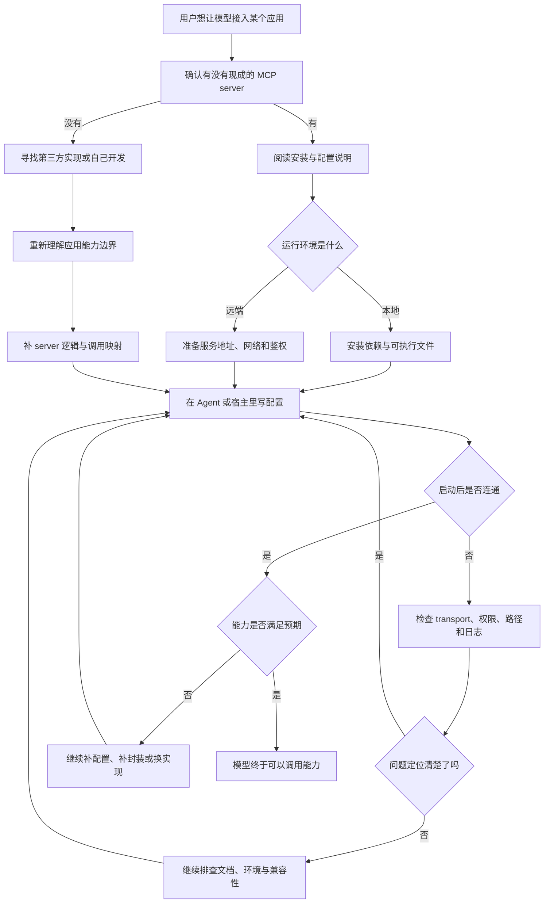
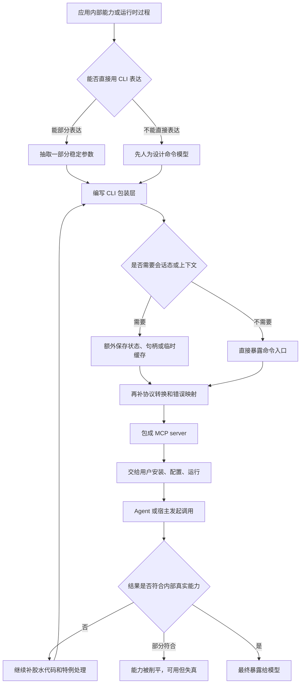

# 我为什么创建了这个项目

## 问题所在

我创建 MDP，最直接的原因是我认为今天的 MCP 体系虽然解决了一部分问题，但它离“让大模型真正低成本接入现实世界”还差得很远。

很多讨论会把重点放在“有没有工具协议”“能不能把能力暴露给模型”上，但在真实使用里，决定一套方案是否能走向更广泛应用的，往往不是它在概念上是否成立，而是它在工程上、产品上和用户体验上是否足够轻。

如果一套机制只能被少数高技术用户稳定使用，或者必须依赖平台方做大量额外封装才显得易用，那它离真正的普及还有很大距离。我创建 MDP，就是因为我越来越明确地感受到，问题的核心不是再多接几个工具，而是要把“接入万物”这件事本身的复杂度降下来。

## 用户成本

从用户视角看，MCP 的配置复杂、使用成本高。它往往要求用户具备比较高的技术素养，至少要理解 server、配置项、连接方式、权限边界这些概念。如果用户没有这些能力，就只能依赖 Agent 平台或者某个产品层去替他做一层封装，把原本复杂的行为隐藏起来。问题在于，这种封装一旦不存在，或者平台没有帮你接好，用户就还是得自己上手，门槛并没有真正消失。

更现实的问题是，今天各种应用都要求用户主动去安装 MCP server。也就是说，能力的接入责任被推给了最终用户。谁想让模型操作一个工具、一个应用、一个本地环境，谁就得先研究怎么装、怎么配、怎么运行、怎么维护。这对少量技术用户也许还能接受，但如果目标是更广泛的产品化使用，这样的路径显然太重了。

### 接入路径

这条路径的问题并不只是步骤多，而是每一步都要求用户理解系统内部的结构。安装、配置、启动、排查，本来都不应该成为最终用户的主要任务，但在现有模式下，它们经常变成了使用前提。

## 内部过程

除此之外，还有一个更深层的问题一直没有被很好解决，那就是应用内部或者进程内部的大量过程，并不能通过统一、标准的协议自然地暴露出来。很多时候我们只能不断去写 CLI，把内部能力重新包装成命令行接口，再想办法让模型去调用。但这条路本身就有明显边界。

CLI 适合暴露一部分能力，却不适合承载所有能力。很多过程天然就是运行时态的、上下文相关的、事件驱动的，甚至依赖图形界面、内存状态、会话生命周期或者宿主环境中的对象引用。这些东西并不是把参数拼成一条命令就能表达清楚的。有些过程根本无法通过 CLI 提供出来，即使勉强包一层，也会带来巨大的维护成本、抽象损耗和使用成本。

比如一个编辑器内部的选区状态、一个浏览器页面里的实时 DOM 语义、一个扩展宿主里的事件流、一个应用运行中的会话对象，很多都不是天然的“输入参数 -> 运行命令 -> 返回结果”模型。你一旦强行把它们压成 CLI，就意味着你要自己处理状态投影、生命周期同步、上下文丢失和接口退化。

### 包装路径

在这条链路里，真正的问题不是“能不能调用”，而是“为了能调用，付出的代价是否合理”。很多原本丰富、持续变化、依赖上下文的内部过程，在被压成 CLI 之后，能力边界和语义都会被削弱，最后虽然看起来接入了，实际上却失去了很多关键表达力。

## 复杂度转移

这就是我看到的困境。MCP 在努力解决工具接入问题，但它和其他工具体系一样，仍然很难覆盖这些更靠近应用内部、更靠近运行时真实状态的能力。而一旦你想跨过这个缺口，成本就会迅速上升，最后又回到“为每一种场景单独做适配、单独做封装、单独做桥接”的老路上。

这时复杂度会不断转移，但不会消失。它有时落在最终用户身上，有时落在平台方身上，有时落在应用开发者身上。只是无论落在哪一层，大家做的事情都很像：写额外的 glue code，补额外的兼容逻辑，维护额外的安装路径，处理额外的状态同步问题。

而一旦复杂度只能靠局部封装来消化，整体生态就会变得越来越碎。每个平台都需要自己的集成方式，每个应用都需要自己的桥接方式，每个宿主都可能有自己的接线规则。最后模型接入世界的过程，看起来是统一的，实际上仍然是很多碎片方案的拼接。

## 为什么是 MDP

我不想继续在这个方向上堆越来越多的局部方案。我更想做的是重新定义一层更适合大模型接入万物的协议，让能力的暴露、注册、发现、调用和路由都能够建立在一套更自然的规范上，而不是把所有问题都压缩成“装一个 server，再暴露几个 CLI”。

所以我设计了 MDP。它的出发点不是替换某一个具体工具，而是试图解决一个更基础的问题：如何让应用、进程、宿主环境以及它们内部真实存在的能力，以一种统一、标准且足够轻量的方式被大模型接入。

我希望能力提供方可以在更接近真实运行时的位置去暴露能力，而不是总要先绕到命令行这一层。我也希望宿主侧面对接的是稳定的桥接界面，而不是每接一个系统就重新发明一次接线方式。更重要的是，我希望最终用户不必再为“接一个能力”承担过多工程责任。

### 简化路径

在系统层面，这条被简化后的路径会收敛到同一套稳定的 MDP 架构：

<SharedMermaidDiagram name="architecture/overview" />

这里的变化在于，用户不再需要先研究某个应用有没有独立的 server、应该怎么配置 transport、配置文件应该写在哪里，也不需要先把复杂的接线过程自己走一遍。对用户来说，路径被压缩成了几个足够直接的动作：在 Agent App 里安装 MDP MCP，打开支持 MDP 的应用，然后直接让 AI 去控制它。

## 简化结果

在这套规范下，能力不必先退化成命令行，不必总是依赖用户手工安装，不必每次都借助平台做厚重封装，也不必为每一种宿主形态单独发明一套沟通方式。应用可以成为能力的直接来源，服务端负责注册和路由，宿主看到的是稳定的桥接表面，大模型接入的路径也会因此简单得多。

### 具体成本

真正被简化掉的，其实是几类长期反复出现的成本：

- 用户学习安装、配置和排错链路的成本。
- 平台为不同能力来源反复写封装层的成本。
- 应用为了适配命令行抽象而丢失真实能力表达的成本。
- 生态里每一种宿主、每一种应用都各自造桥的成本。

## 最终目标

我并不认为任何一个协议能一次性解决所有问题，但我相信方向必须先对。MDP 想做的，就是把过去那些难以统一、接入成本极高、产品化困难的问题，重新拉回到一个可以被规范化、工程化和规模化处理的框架里。

这就是我创建这个项目的原因。不是为了再增加一个概念，而是为了让大模型更轻松地接入万物，并且让这件事终于可以用更合理的成本被实现。
