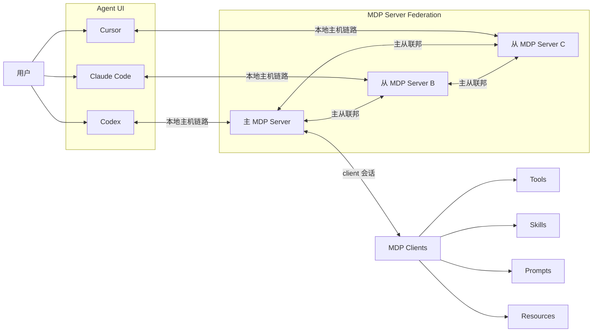
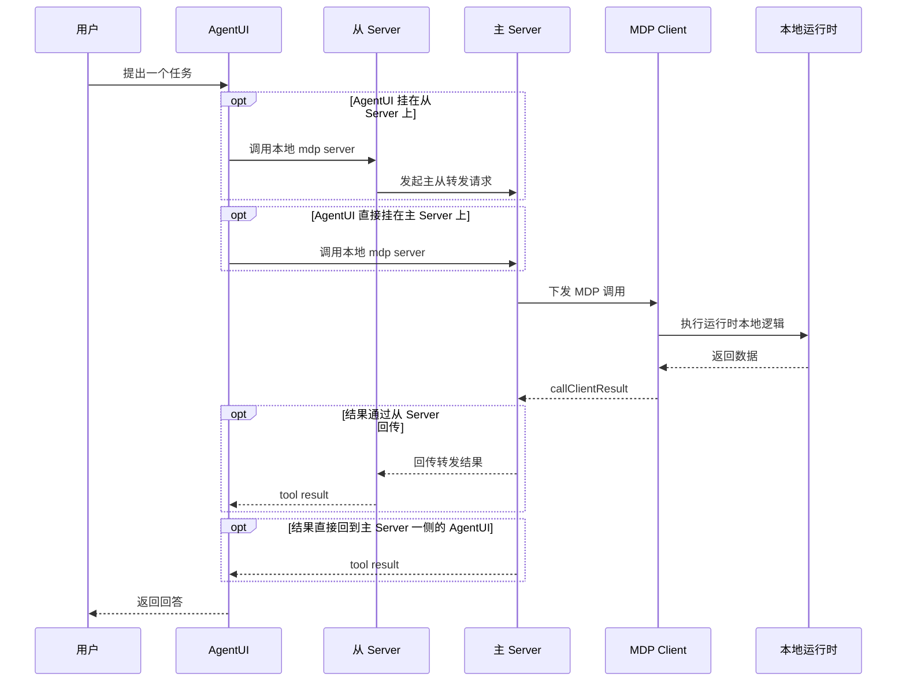
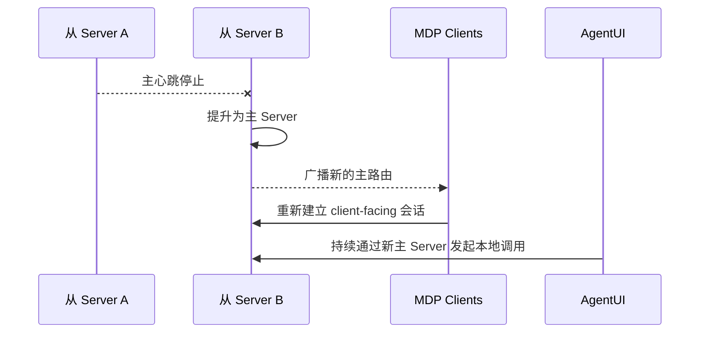

# 架构

完整链路里一共有五层角色：

1. 用户开始使用 Agent 工具输入特定提示词。
2. 每个 `AgentUI` 都连接自己对应的本地 `mdp server`。
3. 一个 `主 mdp server` 持有运行时本地 client registry。
4. 一个或多个 `从 mdp server` 与这个主 server 保持连接。
5. `MDP clients` 从具体运行时暴露本地能力，并且只连接主 server。

## 调用路径

一条完整调用穿过整条链路时，可以选择直接进入主 server，也可以在存在从 server 时先经过从 server：

## 故障切换路径

如果当前主 server 不可用，则应由某个从 server 自动提升为新的主 server，这样整条联邦链路还能继续路由 client 调用。

这个架构约束很简单：

- client 在正常情况下只连接当前主 server
- 从 server 持续监测主 server
- 当主 server 消失时，由某个从 server 升级为新的主 server
- client 和 AgentUI 一侧的流量都应重新收敛到这个新主 server
- 然后再以这个新主 server 为中心重建联邦关系

关于具体的启动模式和示例，继续阅读 [部署模式](/zh-Hans/server/deployment)。关于 server 侧运行时模型，继续阅读 [Server Overview](/zh-Hans/server/overview)。
