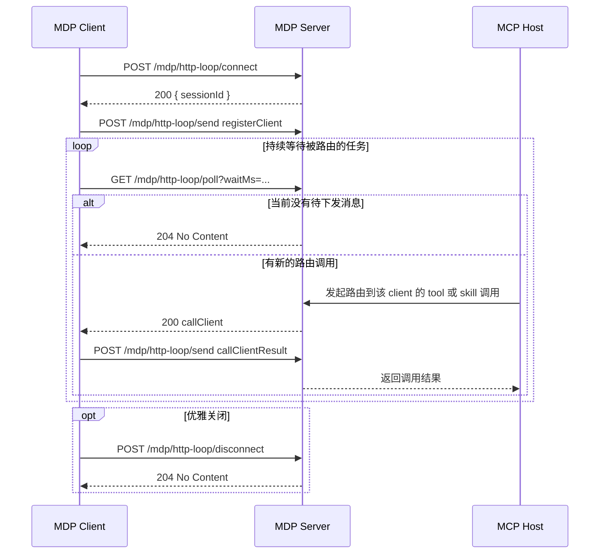

# HTTP Loop 建立链接

HTTP loop 是 websocket 之外的 request-response 传输方式。

## 端点总览

| 方法   | 路径                                                                    | 作用                               |
| ------ | ----------------------------------------------------------------------- | ---------------------------------- |
| `POST` | [`/mdp/http-loop/connect`](/zh-Hans/server/api/http-loop-connect)       | 创建 loop 会话                     |
| `POST` | [`/mdp/http-loop/send`](/zh-Hans/server/api/http-loop-send)             | 发送一条 client-to-server MDP 消息 |
| `GET`  | [`/mdp/http-loop/poll`](/zh-Hans/server/api/http-loop-poll)             | 拉取一条 server-to-client MDP 消息 |
| `POST` | [`/mdp/http-loop/disconnect`](/zh-Hans/server/api/http-loop-disconnect) | 关闭 loop 会话                     |

## session 标识

`connect` 之后，后续请求需要通过下面任一方式携带 session ID：

- `x-mdp-session-id` header
- `sessionId` query 参数

## connect

请求：

```json
{}
```

响应：

```json
{
  "sessionId": "6c8a3b2b-7f2b-4be5-a2d8-1f0c8c4f8b54"
}
```

## 轮询链路

1. `POST /connect`
2. 通过 `/send` 发送 [registerClient](/zh-Hans/server/api/register-client)
3. 持续 `GET /poll`，直到拿到 [callClient](/zh-Hans/server/api/call-client) 或 `204`
4. 通过 `/send` 回传 [callClientResult](/zh-Hans/server/api/call-client-result)
5. `POST /disconnect`

`/poll` 上的 `waitMs` 最大会被限制到 `60000`。

## 时序图



如果你要看每个端点的精确请求和响应格式，继续阅读：

- [POST /mdp/http-loop/connect](/zh-Hans/server/api/http-loop-connect)
- [POST /mdp/http-loop/send](/zh-Hans/server/api/http-loop-send)
- [GET /mdp/http-loop/poll](/zh-Hans/server/api/http-loop-poll)
- [POST /mdp/http-loop/disconnect](/zh-Hans/server/api/http-loop-disconnect)

## 适合什么时候用

- 运行时无法保持 websocket
- 运行环境只支持普通 HTTP 请求响应
