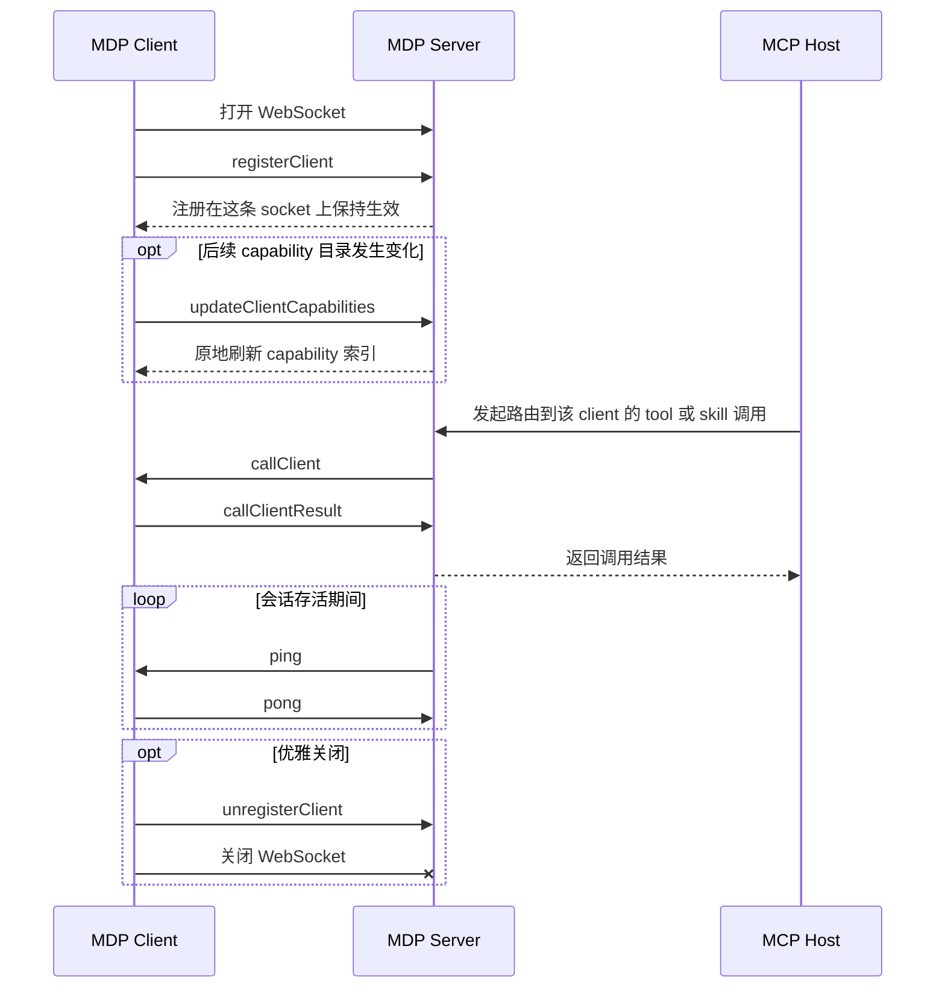

# WebSocket 建立链接

当 client 可以保持一个长连接时，优先使用 websocket transport。

## 入口

- `ws://127.0.0.1:47070`
- 启用 TLS 后是 `wss://127.0.0.1:47070`

## 消息模型

websocket 端点收发的是 JSON 编码的 MDP message。

## 事件类型

websocket transport 通过 `type` 字段区分事件类型。

| 事件类型           | 方向             | 分类     | 作用                                    |
| ------------------ | ---------------- | -------- | --------------------------------------- |
| `registerClient`   | Client -> Server | 生命周期 | 注册一个 client 及其 capability 元数据  |
| `updateClientCapabilities` | Client -> Server | 生命周期 | 替换一个或多个 capability 目录          |
| `unregisterClient` | Client -> Server | 生命周期 | 注销一个已注册 client                   |
| `callClient`       | Server -> Client | 调用     | 把路由后的 capability 调用下发给 client |
| `callClientResult` | Client -> Server | 调用     | 回传一次路由调用的执行结果              |
| `ping`             | 双向             | 心跳     | 保持连接存活                            |
| `pong`             | 双向             | 心跳     | 确认一次心跳                            |

## 按方向查看

client 发给 server 的事件：

- [registerClient](/zh-Hans/server/api/register-client)
- [updateClientCapabilities](/zh-Hans/server/api/update-client-capabilities)
- [unregisterClient](/zh-Hans/server/api/unregister-client)
- [callClientResult](/zh-Hans/server/api/call-client-result)
- [ping](/zh-Hans/server/api/ping)
- [pong](/zh-Hans/server/api/pong)

server 发给 client 的事件：

- [callClient](/zh-Hans/server/api/call-client)
- [ping](/zh-Hans/server/api/ping)
- [pong](/zh-Hans/server/api/pong)

## 典型事件流

一条常见的 websocket 链路通常是：

1. 打开 websocket
2. 发送 `registerClient`
3. 当本地 capability 目录变化时，可选发送 `updateClientCapabilities`
4. server 有任务时下发 `callClient`
5. client 回传 `callClientResult`
6. 会话期间双向收发 `ping` 与 `pong`
7. 断开前可选发送 `unregisterClient`

## 时序图

## 每类事件是干什么的

- `registerClient`：声明 client 身份，以及当前的 tool、prompt、skill、resource 目录。
- `updateClientCapabilities`：在不变更 client 身份的前提下，替换一个或多个已注册 capability 数组。
- `unregisterClient`：在 transport 还活着时，移除某一个逻辑 client 注册。
- `callClient`：携带一次被 server 路由过来的调用，包含 `requestId`、目标 client、能力类型和调用载荷。
- `callClientResult`：结束一次调用，返回 `data` 或 `error`。
- `ping`：要求对端确认连接仍然存活。
- `pong`：确认收到了一次 `ping`。

## 适合什么时候用

- 运行时能稳定持有 socket
- 希望降低双向消息延迟
- 不想自己维护 long-poll session

## 多 server 说明

如果你的部署里同时存在 hub server 和一个或多个 edge server，websocket client 应该连接哪个 server，应该由部署策略决定，而不是靠盲试端口。可以通过 `/mdp/meta` 或显式配置来判断：当前运行时应该注册到一个 standalone hub，还是注册到一个会向上 proxy 的本地 edge。
