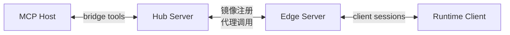

# 部署模式

server 可以运行成一个 standalone registry，也可以运行成一个把本地 clients 镜像到上游 hub 的 edge。

CLI 默认会以 `auto` 模式在 `47372` 这个端口启动。

推荐把规则收敛成一句话：

- host 只面向一个 hub 的 bridge surface
- 运行时本地 clients 通常连接离自己最近的 edge
- 连接 hub 还是 edge，应该由部署策略决定，而不是让 client 自己猜

## Standalone

当一个 server 同时持有本地 registry 和 bridge surface 时，使用 standalone 模式。

```bash
npx @modeldriveprotocol/server --port 47372 --server-id hub
```

适合这些情况：

- 你只需要一个本地 MDP server
- clients 可以直接注册到 bridge-facing server
- 你希望本地部署尽量简单

## Auto

Auto 模式会先探测有没有上游 MDP hub。找到就把本地 clients 向上镜像，找不到就继续以 standalone server 运行。

```bash
npx @modeldriveprotocol/server --cluster-mode auto --server-id edge-01
```

默认发现流程会：

- 探测 `127.0.0.1`
- 从 `47372` 开始
- 最多检查连续 `100` 个端口
- 通过 `GET /mdp/meta` 判断某个端口是不是 MDP 服务
- 在真正建立 proxy 链路之前，先确认上游元数据里声明了兼容的 protocol 版本

需要时可以手动调参：

```bash
npx @modeldriveprotocol/server \
  --cluster-mode auto \
  --discover-host 127.0.0.1 \
  --discover-start-port 47372 \
  --discover-attempts 100 \
  --server-id edge-01
```

## Proxy-Required

Proxy-required 是 auto 的严格版本。server 必须找到一个上游 hub，否则直接启动失败。

```bash
npx @modeldriveprotocol/server \
  --cluster-mode proxy-required \
  --discover-host 127.0.0.1 \
  --discover-start-port 47372 \
  --discover-attempts 100 \
  --server-id edge-02
```

适合这些情况：

- 这个 server 绝不能意外成为根 bridge
- 你的部署明确要求存在一个 hub
- 启动时应该快速失败，而不是悄悄切换拓扑

## 显式指定上游

如果你已经知道 hub 的 URL，就直接跳过扫描，显式指定上游。

```bash
npx @modeldriveprotocol/server \
  --port 47170 \
  --cluster-mode proxy-required \
  --upstream-url ws://127.0.0.1:47372 \
  --server-id edge-01
```

这对脚本、测试和固定的本地开发环境是最可预测的方式。

## 探针接口

发现流程使用的元数据探针是：

- `GET /mdp/meta`

返回示例：

```json
{
  "protocol": "mdp",
  "protocolVersion": "0.1.0",
  "supportedProtocolRanges": ["^0.1.0"],
  "serverId": "127.0.0.1:47372",
  "endpoints": {
    "ws": "ws://127.0.0.1:47372",
    "httpLoop": "http://127.0.0.1:47372/mdp/http-loop",
    "auth": "http://127.0.0.1:47372/mdp/auth",
    "meta": "http://127.0.0.1:47372/mdp/meta"
  },
  "features": {
    "upstreamProxy": true
  }
}
```

这个接口服务于部署控制平面逻辑，不是一个 MDP wire message。一个 server 决定是否向另一个 server 建立 proxy 关系时，应把 `protocolVersion` 视为精确 semver，把 `supportedProtocolRanges` 视为 semver range 列表。

如果要看精确的 CLI 参数和启动语法，继续阅读 [CLI 参数](/zh-Hans/server/cli)。

## 推荐拓扑

如果你要做分层本地部署，建议按下面的结构：

1. 一个已知端口上的 hub，例如 `47372`
2. 一个或多个运行在独立端口或临时端口上的 edge
3. 运行时本地 clients 注册到离自己最近的 edge
4. MCP hosts 只和 hub 通信



## Client 应该连谁

client 不应该靠盲扫端口去猜自己该连哪个 server。

更合适的做法是：

- 显式配置正确的 `serverUrl`
- 直接连接部署策略指定的本地 edge
- 在真正打开 transport 前，通过 `/mdp/meta` 做 bootstrap 判断

如果一个运行时按预期应该接到本地 edge，尽量把这个选择放在 capability client 之外的部署层完成。
